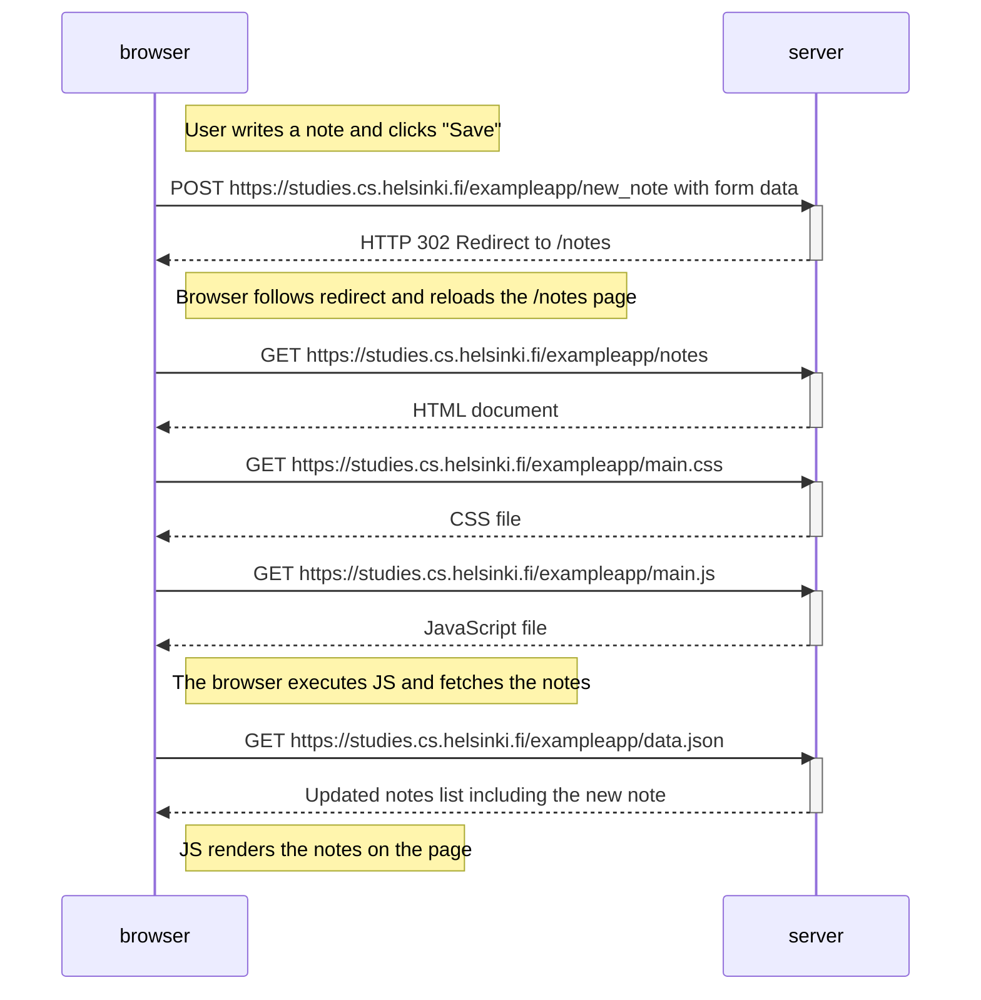

# Diagrama de creación de una nueva nota

Este diagrama muestra lo que sucede cuando un usuario escribe una nueva nota en la página [https://studies.cs.helsinki.fi/exampleapp/notes](https://studies.cs.helsinki.fi/exampleapp/notes) y hace clic en "Save".

